# 영어단어 프로젝트

## 프로젝트 개요
* 시작하게 된 계기
  * 영어를 공부하려는데 사용하려는 애플리케이션이 웬만해서는 유료였고 이 정도면 직접 만들 수 있겠다는 생각이 프로젝트의 시작점이었습니다.
* 제작 기간 
  * 2023 3.1 ~ 5.7(계속해서 기능을 추가할 예정)
* 주요 기능 및 목적
  * 단어 저장, 삭제,  편집, 검색, 학습
  
## 기술 스택
* Node.js
* React
* Postgresql
  
## 개발 과정
* 3월 1주
  * 텍스트 파일로 만들고 싶은 영어단어 사이트에 대한 필요 기능을 정리
  * 사이트의 사용할 메인 컬러를 결정
  * 카카오 오븐을 통해 UI를 구상(https://ovenapp.io/view/xoABBPXR6YB8W3zMkAuUgavG4hvLyAUC/keNCa)
  * 로그인 페이지와 목록 페이지를 제작
  * 요청받아 처리할 서버를 제작
* 3월 2주
  * 현재 프로젝트의 문제점을 파악
    - 처음 구상한 단어 저장 및 편집은 서버에 있는 text 파일을 불러오고 수정하는 방식, 하지만 이러한 기능은 node.js에서 파일을 읽어올 수는 있어도
    직접적으로 수정은 힘들었기에 이 방법 말고 session을 통해 단어를 저장하고 불러오고 편집하는 방식으로 구현
    - 영어 번역 기능을 파파고 API를 이용하여 구현하려 했으나, 이 경우 번역은 되나 사용 빈도가 정해져 있고 결과물도 단순히 번역 결과만 나와
    실제로 학습하면서 검색 기능으로써 쓰기에는 불편하여 사전 사이트 주소의 뒤에 get 방식으로 검색하는 단어를 붙여 해당 사전 사이트를 불러오는 방식으로 구현
  * 파악한 문제점을 개선하는 방향으로 개발
* 3월 3주
  * 로그인이나 페이지 간 이동할 경우 어떻게 정보를 전달 및 유지를 할지 고민
    - 이 과정에서 cookie, location, session 등을 사용해 보면서 location이 가장 적합하다고 판단하여 이를 사용하여 구현
  * 현재 프로젝트의 문제점을 파악
    - session을 통해 단어를 저장 및 편집하는 과정에서 요청이 제대로 처리되지 않아 오류가 자주 발생
      session이 아닌 DB(Postgresql)를 통해 처리하기로 결정
      기존 구조 React <-> node.js(session을 통해 단어처리) 에서 React <-> node.js <-> Postgresql로 변경
  * 단어 추가 페이지 구현
    - 단어 검색이 가능
    - 단어 추가가 가능하고 추가하면 추가한 단어가 목록으로 나옴
  * 단어 목록 페이지 구현
    - 불러오기 버튼을 통해 단어를 불러오기
    - 상단에 리모컨 메뉴를 추가 단어 추가, 학습, 편집화면과 연결 및 영어 발음 속도를 조절 가능
    - 단어마다 발음 버튼 및 삭제 버튼을 추가 단어를 누르거나 마우스를 올릴 경우 단어가 움직이며 잘린 부분도 볼 수 있다.
* 3월 4주
  * 구현한 페이지에 기능을 개선
    - 회원가입 시 같은 아이디가 있는지 조회, 조회를 안 하고 가입하려고 할 시 조회하라는 메시지를 출력
    - 만일 해당 아이디가 있을 때 입력 칸이 글자가 빨간색으로 변환. 다시 조회해서 가능하면 원상 복귀
    - 로그인이나 회원가입 시 비밀번호를 확인할 때 hover를 통해 반응할 때만 보이게 설정했지만, 이럴 경우 모바일에서 입력 칸을 눌렀을 때
    비밀번호가 보이는 이벤트가 우선으로 반응하여 입력할 수 없어 따로 버튼을 만들어 비밀번호를 볼 수 있게 구현
    - 목록 및 편집 페이지에서 추가한 단서 내에서 검색이 가능 상단 검색 창에 입력한 값이 포함된 영어단어만이 목록에 나온다.
  * 4월 1주
  * 편집 페이지 블록 구현
    - 각 블록(단어)의 영어, 뜻을 input 태그에 값으로 넣고 이를 변경하면 변경된 값을 저장
    - 왼쪽에는 선택 버튼을 오른쪽에는 개별 삭제 버튼을 구현
  * 편집 페이지 리모컨 기능 추가
    - 선택 버튼 : 모든 블록을 선택 혹은 선택 해제
    - 삭제 버튼 : 선택된 블록을 모두 삭제
    - 변경 버튼 : 변경한 영어 단어를 저장
  * 학습 설정 페이지 구현 : 단어 개수, 제한 시간, 학습 방식을 선택(스펠링 채우기, 단어 맞추기, 영어단어 맞추기)
* 4월 2주
  * 학습 설정 페이지 기능 구현 : 각 버튼을 누르면 그에 맞는 문제에 필요한 요소를 전달(문제, 제한 시간, 문제 개수, 선택지 등등)
  * 단어 맞추기 화면 구현 : 문제로 영어단어가 나오면 4가지 선택지 중 맞는 뜻을 선택
    - 제한 시간이 넘어갈 경우 자동으로 종료
    - 정답과 오답을 기록하여 나오게 한다.
  * 영어 단어 맞추기 화면 구현 : 위와 반대로 뜻이 나오면 맞는 영어단어를 선택
    - 제한 시간이 넘어갈 경우 자동으로 종료
    - 정답과 오답을 기록하여 나오게 한다.
* 4월 3주
  * 학습 화면 전체적으로 개선
    - 시간제한을 나타내는 바를 추가
    - 시간제한 기능 오류 수정(문제를 풀수록 정해진 시간보다 짧아지는 문제를 개선)
  * 스펠링 채우기 : 중간중간 비어 있는 영어단어를 선택지로 채운다
    - 단어별로 스펠링 틀린 때마다 오타를 1씩 증가
    - 오타가 4 이상 나올 경우 해당 단어는 오답 처리 후 다음으로 넘어간다
    - 제한 시간이 넘어갈 경우에도 종료
  * 단어 추가 시 해당 단어가 있는지 확인하고 있으면 추가 안 되게 막는다.
  * 단어 목록 불러올 시 어떤 순서로 불러올지(알파벳 오름차, 내림차순, 추가 오름차 내림차순)
* 4월 4주
  * 학습화면 시간제한 유형 수정 : 기존은 모든 제한 시간을 다 합쳐서 했으나 이제 각각 단어별로 타이머를 설정
  * 단어 맞추기 구현
    - 뜻과 영어 발음을 듣고 아래에 키보드를 통해 단어를 맞춘다.
  * 목록, 편집화면 스타일 수정
* 5월 1주
  * 테마 변경 모드 추가(다크테마, 화이트테마)
  * 학습 모드 오류 수정

## 구현 내용
### 로그인 
실행|설명
---|---|
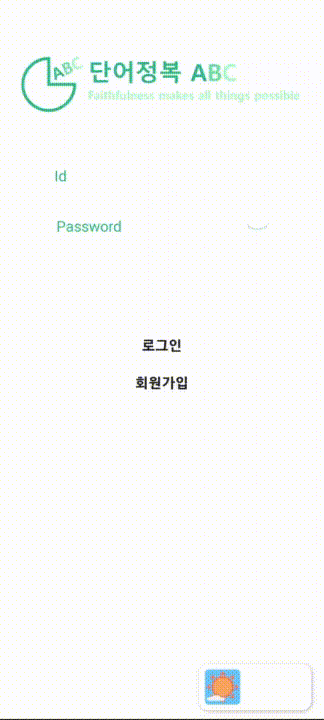| 아이디와 비밀번로를 통해 로그인   입력한 정보가 틀리면 알람창   회원가입창 이동 가능   우측 하단에 테마변경 리모콘(테마변경은 학습 화면 말고는 전부 존재한다)

### 회원가입 
실행|설명
---|---|
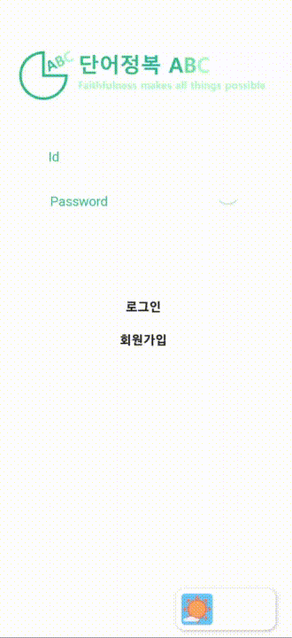| 아이디, 이메일, 비밀번호로 회원가입   아이디는 중복이 되는지 확인   중복일 경우 빨간색으로 변하며 가능할 경우 검은색으로 변한다

### 목록
실행|설명
---|---|
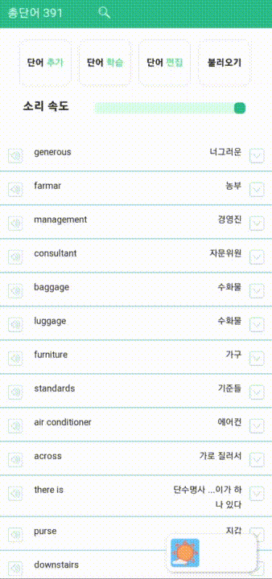| 단어 불러오기를 통해 단어를 정렬

### 단어추가 및 목록 설명
실행|설명
---|---|
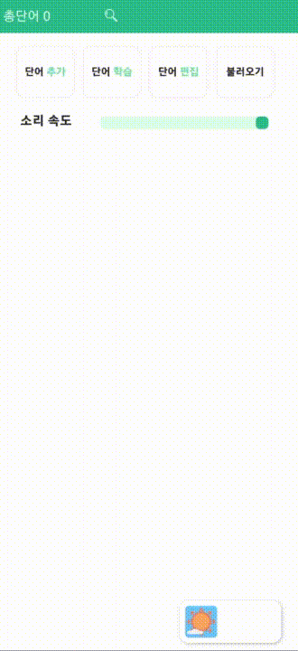| 단어와 뜻을 입력하여 저장   단어는 옆에 아이콘을 통해 검색을 할 수 있다   이미 추가한 단어일 경우 추가가 되지 않는다   추가한 단어는 아래 목록에 나온다   추가 된 단어는 목록 페이지 나오며 목록에 있는 단어는 각각 발음을 들을 수 있고 삭제도 가능하다.

### 편집화면
실행|설명
---|---|
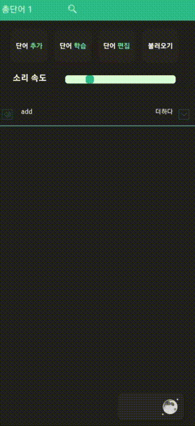| 특정 단어만 여러개 선택하여 삭제   전체 선택, 해제 가능   각 단어의 뜻과 단어를 변경 가능   전체선택, 삭제, 변경은 좌측 하단의 리모콘을 통해 사용 

### 학습화면 설정
실행|설명
---|---|
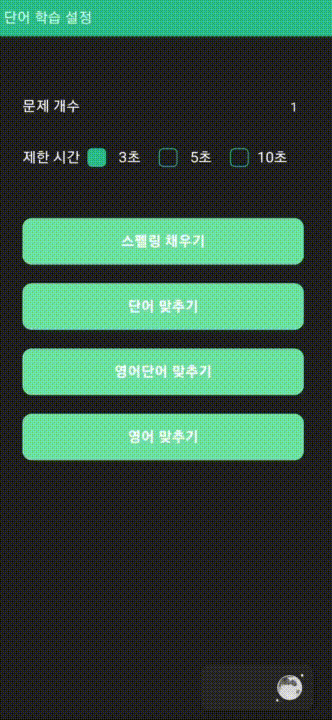| 학습화면을 설정   문제 개수 설정(1 ~ 추가한 단어 수 만큼)   문제 별 제한 시간 설정   여러 학습 모드 선택 가능 

### 스펠링 채우기
실행|설명
---|---|
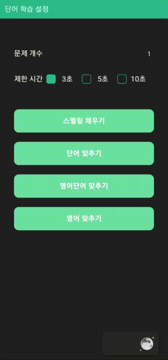| 랜덤으로 나누어진 스펠링을 빈칸에 알맞게 채워 넣는 문제   *모든 학습화면은 끝난 후 틀린 문제가 나온다

### 단어 맞추기
실행|설명
---|---|
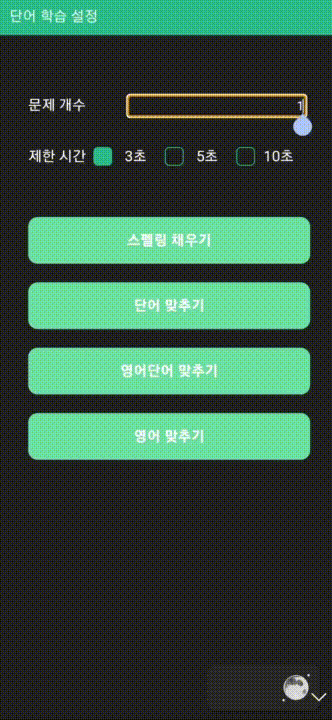| 단어를 보고 맞는 뜻을 고르는 문제

### 영어 단어 맞추기
실행|설명
---|---|
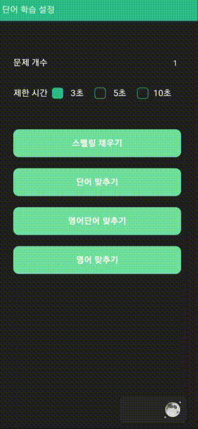| 뜻을 보고 맞는 영어 단어를 고르는 문제

### 영어 
실행1|실행2|설명
---|---|---|
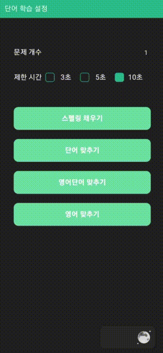|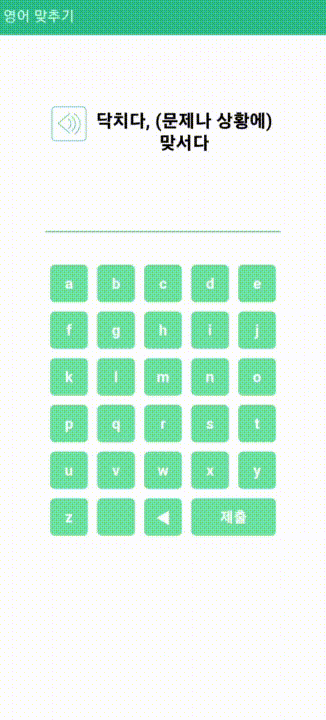| 뜻과 발음을 듣고 해당 단어에 스펠링을 입력하는 문제
